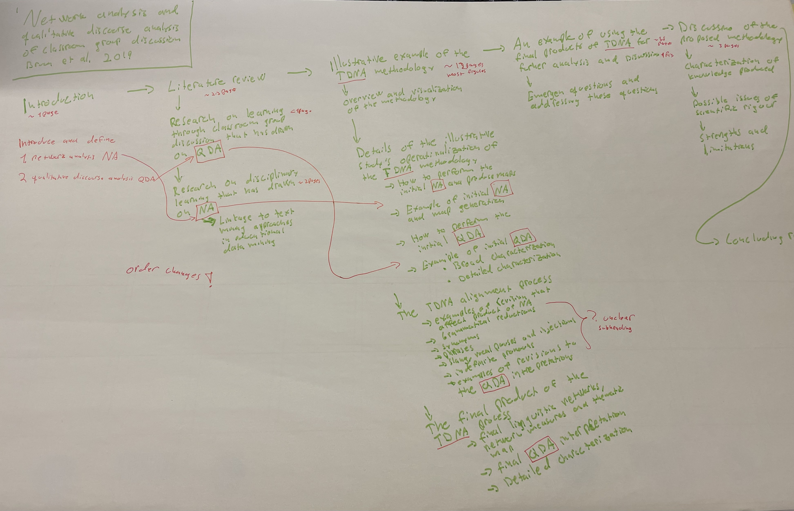

# Course diary for Writing Your Journal Article

## Week 1 - Deciding My Plan for Writing
### My feelings about My Experience of Writing
For me writing has always been challenging and pinpointing why exactly is difficult. It might be some kind of insecurity in a sense that if I don't write, I don't have to send it for supervisors or referees and I don't get negative feedback or something. Therefore, I really need time to get myself into right headspace. Once I get started, I get the work done. However, this usually results in binge writing in weekends that is not sustainable and leads to more negative feelings about writing.

On the positive side, once I get the writing done and I'm pleased with my text, I get nice sense of accomplishment and pride. I do hope to learn more progressive writing habits to get more these positive feelings and less anxiousness.

### Common Elements in My Negative Feelings about Writing
* Procrastination due anxiousness 
* Feeling lazy due to procrastination
* Angry and disappointed in myself due to not writing
* Feelings of inadequacy 

### Common elements in My Positive Experiences of Writing
* Getting good feedback or even praise
* Sense of relevance or meaning for my writing
* Rereading previous text and liking my own writing

### Obstacles to Writing My Article
Here are my major obstacles for my writing goals. Most are taken form the list provided by the book.

|Emotional obstacles|Expected Interference|
|---|---|
|Not in the right mood |medium |
|I just can't get started |medium |
|I will write just soon as I have the time |high |

|Distraction obstacles|Expected Interference|
|---|---|
|I get distracted by emails etc.|low |
|Other work responsibilities are taking my time|medium |
|I spend too much time on other tasks (programming, data analyses)|high |

|Confidence obstacles|Expected Interference|
|---|---|
|I can't write because my ideas suck |low |
|I'm not smart enough |low |
|I write so slowly that I never seem to get much done |medium |

### Possible Solutions to My Interruptions and Obstacles
Before reading the solutions-webpage, here are some solutions I have used already. I usually turn of my email when writing to not get distracted and I also allow myself some time to get other things done so they do not occupy my head too much. This course is the solution for emotional obstacles and to learn new, good writing habits. I do not consider confidence major obstacle any more as I have gained more confidence with the few writing projects have done. However, the lack of confidence still raises its ugly head sometimes.

[Solutions to Common Writing obstacles -webpage](https://wendybelcher.com/writing-advice/solutions-common-writing-obstacles/)

So, after reading the solutions to my obstacles and some others, I think most solutions have already been discussed within the book or I have used or at least tried them. Still it is great to hear (read?) that I'm not the only one with obstacles and problems with writing. Main solutions I intend to adopt is to try writing even when I'm not in the right mood and trust that feelings will follow.

I've chosen SciQua track with revision/drafting pathway and my article will be experimental. I plan to write 20 hours a week and plan to submit by the end of the year.

Not much to say about _day_ 3 as I have already chosen my article. However, it did remind me that I have couple of other drafts or ideas I could develop into articles later. Perhaps while I'm writing my dissertation summary or while it's being reviewed.

Day 4, I'll need more drafting than just revision.

Day 5, I have and will use multiple spaces. More important are my noise cancelling headphones and good ambient or instrumental music. Also some metal to wake me up sometimes.
For this paper I'll be using Latex on Overleaf. That take care of citations (along with Mendeley) and file backups. Additionally, I regularly take manual backups.
Co-authorship is quite clear with my supervisors.

### Some Reflection
This book speaks to me and I recognize myself in many examples of binge writers and bad writing habits. Previously I have done most of my writing only when I had plenty of time and was jealous for people who could just write without first takin an hour or two to get into right mindset. I have hoped to learn to write in smaller chunks and it is great to see that that is the aim of this book and course. Thus, I feel like this course will be tremendously beneficial for me.

For some time now I have thought that my ideal (work)day would include reading, writing and coding (programming/data analysis/scientific computing). With this course I hope to get the confidence to arrange my days to be as close as possible to this ideal. Maybe 15 to 60 minutes each would suffice. I just need to accept and internalize it.

## Week 2: Advancing My Argument
### What is new about my article
My third article will continue the work done in my previous article in which I developed method to construct new materialist network data from video data. The new article will quantitatively analyze the constructed networks and correlate different networks or network measures. This combination of new materialist research and network-based approaches is new and the results quantitative roles and contributions of human and non-human actors. Thus, my methods are new and yield new type of results and insights to learning phenomenon with novel theoretical framework.

### What is my argument?
It is rather difficult to formulate  my argument as I'm still missing my research results. Maybe it will be something like _Roles of human and non-human actors differ by X_ or _Roles of human and non-human actors correlate with actors contributions to overall knowledge with X_ or something like that.

*Argument tests:*
* I don't think my argument passes the agree/disagree test
* I don't think my argument passes the gut test
* My argument doesn't pass the immediate dispute test either

I'm quite sure already that my argument is not an argument and after reading all other test it is quite clear that my arguments are observation or variable statement. Reshaping my possible argument to _Reciprocal roles between human and non-human actors increase actors' contributions to the overall knowledge during student investigations in upper secondary school physics_

After reading the rest of the chapter I don' think  I have argument crisis even tough I don't yet have an actual argument. Similarly, it will be easy for me to consider opposing views or rather state the limitations of my research as a basically have a case study with very limited sample size.

Overall, this chapter about argument was good reading although some examples and such were hard to understand as my background and thinking is so heavily influenced by natural sciences.

And finally, my calendar from week 1

Not pretty and not really accurate, but I'm really bad at this kind of time tracking. As this was not really accurate I did not fill in total minutes and tasks completed, but overall I think I spent good amount of time on this work book and on my articles. Also, I did complete most if not all tasks from the work book. Ultimately, tracking my time was useful and really made me think on what I use my time on. And also helped with procrastination.

## Week 3

### Lessons to Be Learned from My Past Week's Writing experience
I'm still learning to write everyday, but the scheduling really helps. I don't yet know what would be my optimal time for writing. Mornings I like to spend on reading something that might or might not directly relate to my writing task. Also, sometimes in the afternoon I'm just too tired to engage in writing tasks. Maybe I should try to focus on my writing before or right after lunch especially on days I don't have meetings. 

Similarly, writing in small chunks still feels somewhat impossible and impractical. However, yesterday (Monday) I did manage to draft (very roughly) an abstract for seminar proposal in about twenty minutes instead of procrastinating and wasting my time by just waiting for my friend for lunch. Maybe, there is still hope for me.

### What I Learned by Studying Recent Abstracts
I decided to read recent abstracts from the journal I have planned to submit my article. The journal has structured abstracts with subheadings. It seems like that some variation is allowed with the subheadings, but most often the subheading are *Background, Purpose, Sample, Design and method, Results* and *Conclusion*. Actually, I checked the instructions to authors and they state these subheadings, but for some reasons couple of the abstracts omitted one or two of the subheadings.

Overall, I think the structured abstracts are nice. It makes it really easy to gauge if the article is relevant for my own research. Furthermore, it is easy to identify the relevant section (background, methods or conclusion). Thinking back on the tens or even hundreds traditional abstracts I'ne read, evaluating the relevance is sometimes rather difficult and required delving into the body of the text. Especially, as some abstracts seem to be vague on purpose or the 150-200 word limit is just not enough.

I ended up reading about fifteen abstracts and while the structured format made it easy and most abstracts seemed good there was few not so good as well. Even if not particularly bad. For me this indicates that even if the structured format helps and guides with writing the abstract, it is still need some thought and effort to make the abstract to stand out.

### What I Learned by Reading Strong Articles / Articles to Cite in My Article
Unfotunately, none of the abstracts I read indicated particularly strong articles or articles I could cite. However, I had two articles waiting to be read that I will cite in my own article. Luckily, I also felt that the other was also strong.

The first article, *Networks in the Social Sciences: Comparing Actor-Network Theory and Social Network Analysis* by Vicsek et al., (2016), was easy to read and very engaging. The text was clear and concise with the argument of the article was easy to follow. I'd consider this article strong even with the somewhat marginal topic.

The second article, *A Control Analysis Perpective on Katz Centrality* by Sharkey (2017), was more difficult to understand altough it was very short and exact. This is due to the fact that the article basically just defines new centrality measure for networks and I don't have enough understanding or mathematical competence to easily follow the text. Or rather I don't yet quite understand how to utilize this centrality in my own analyses as suggested by one of me supervisors. I need to do some additional reading and thinking, but this is a starting point.

So, what did I learn by reading these articles? It really depends on my own knowledge and understranding how I feel about an article. I'm reminded by what my supervisor said: *"There is no point reading something that you understand the first time."* This was in reference to books and particularly on philosophy. But I think it fits also to journal articles. The first articel I read was nice and easy, but I did not really learn that much by reading it. I could have just read the abstract and understand the authors' argument and even cite it (altough, I might feel unethical doing this) and use my time trying to understand and learn from the second article.

## Week 4: Selecting a Journal
I must admit I only skimmed the text through this time. Partly because I have already chosen the journal for my article and also because I need to focus more on trying to understand the data analysis methods so that I can actually do the analyses. However, reading the chapter was interesting and I think that doing this kind of rigorous evaluation of journals could be beneficial at some point.

I am confident that together my three supervisors have comprehensive knowledge of journals in my field and adjacent fields as well.  We have on several occasions discussed about relevant journals to our research and about the quality of said journals. For example, when deciding the journal for my previous article. We also asked other professors for suggestions after my seminar presentation.

For my current article, we have chosen the [Research in Science & Technological Education](https://www.tandfonline.com/toc/crst20/current) by *Taylor & Francis*. We choose this as the topic fits the journal and we now that the editor is interested in my research.

The journal has impact factor of 1.540 ([all metrics](https://www.tandfonline.com/action/journalInformation?show=journalMetrics&journalCode=crst20))
and jufo level 1 ([jufo page](https://jfp.csc.fi/#!PublicationInformationView/id/66131)). The links provide all relevant information except for acceptance rate or average time for from submission to first decision and I couldn't find that information elsewhere on the journal's website.

## Week 5: Refining Your Works Cited
*Positive Message to Myself about Writing:* You can do it! Even if you sometimes don't feel like it. just trust yourself.

I have experimental data as primary source. I think I have enough contextual literature, but I will need more methodological and theoretical literature as I continue with my network analyses. I don't know about related literature. What even is the difference between contextual and related literature. I don't think anybody discusses the exact same topic or argument. Hmm.. . Maybe in sciences contextual and related is almost same.
No derivative documents cited.

I might need more citations from the journal, but other than that I don't really have any of the common mistakes.

I think I should develop better and more systematic method for note taking, so that I don't accidentally paraphrase.

I always need to get better grasp of different theories in my field, but maybe not now for this paper.

I don't think I'll need more related literature.

My entry point is addressing a methodological gap and extending previous work by combining theoretical frame and analysis method not used previously.

The text about citation values and biases was quite interesting. Looking forward for the discussion about these as this is something I really hasn't considered before. I actually think that currently education sciences are too author centric. Therefore, I don't like the apa-style citations and much more prefer number based formats. Although, I agree that sometimes the apa-style makes it easier to discuss and identify some works. Anyhow, maybe this citation values is more important in humanities and especially relevant in the States.

## Week 6: Crafting Your Claims for Significance

I think I might have subject-based claim for significance as I'm first to do this kind of research, but it is not clearly stated in the article. Not really audience-, literature- nor practice-based. Certainly method-based claim as it is new method within the theoretical framework I'm using and thus also the finding could be new. I maybe could also craft field-, theory- or implications-based claims, but they would not be so honest or relevant.

**My three claims for Significance**

1. Subject-based: The materials students use during science lesson investigations are not commonly considered explicitly as actors in the knowledge construction and thus the role of materials have not been adequately researched.
2. Method-based: Network analysis based approaches allow quantitative research within the new materialist frameworks.
3. Findings based: Once I have the findings

## Week 7: Analyzing Your Evidence
My data is not strictly qualitative or quantitative, but for this article it will be mainly quantitive. My data is networks constructed from video sample of upper secondary school physics lessen where group of students make simple investigation. The construction of these networks relied on some qualitative methods, but I'd argue the construction of the networks was actua post-qualitative. In any case, currently I'm analyzing those networks i.e. computing network measures and thus I  will have quantitative evidence.

Again, as I'm still doing the analysis and I do not yet have the evidence, so it is impossible to check the proportions of evidence to interpretation. However, I'm sure I will have good amount of evidence and I will also have good visualizations for my evidence. At this point I'm not sure if my evidence will have some limitations.

My evidence will be somewhat statistically insignificant, but my research is basically a case study. Methods are not poor. There will be no causal claims. There should not be any proxy errors or comparability issues. Relevance and placement cannot be assessed at the moment. 

Similarly, quality of interpretation cannot be assessed as I do not yet have interpretations. Hopefully I will get the analyses done next week so I can start working on and writing the interpretations. I will then get back to this chapter and hope I can write my interpretations within a week or two.

## Week 8: Presenting Your Evidence
I do not need to obtain permission for using others' images or texts.

### Revising Your SciQua Presentation of Evidence
#### Revising Your SciQua Methods
Describe your sample and sampling procedure: To do

Describe your measurement instrument: To do

Describe your research context: To do

Describe your variables: Not applicable, maybe?

Write in past tense: Done

Don't give statistics tutorial: Not applicable

Don't mix your results: To do

Match Methods subheads to Results subheads: Done

Watch repetition: To do

Check with your journal for instructions: To do

Keep it short: To Do

#### Revising Your SciQua Results
At the time of reading I'm still working analyzing the network and have only some preliminary results. Furthermore, I still need to choose if I need more analyses/results or should I discard some results. I'll be using graphs and tables, but I am confident I can design these properly. Tables and graphs showing results are highlighted in physics since secondary school and I have interest in data visualization so I think the results section will be the easiest overall. Although, of course the section will need to be checked and revised after the first draft is done. 

#### Revising Your SciQua Discussion
These are all to do/not applicable as I have yet to write single word of discussion. However, most of these points are more or less apparent or rather I know these already. Though, again, it will be good to go through these explicitly after I have written first draft of the discussion.

### Revising Your Presentation of Evidence in Illustrations
I think this goes with the basics of graphs and figures I know comprehensively. For most part these are not applicable as I won't be using photographs or illustrations other than the results. 

## Week 9: Strengthening Your Structure
Does my article contain more than descriptive or sequence macrostructure: Yes

Would my article benefit from using more of one of these orders: Well, yes, as my article has rather new ideas to start with the familiar, the easy and the accepted when describing what was done and why.

Would my article benefit from attending more to Hayot's Uneven U structure? As interesting as the Uneven U is,  don't see it useful for my article.

Structure signals not really applicable at the moment, but I do have quite good subheadings.

Lab reports are big part oh physics education and they do follow the IMRAD structure quite closely even tough are bit different than journal articles. Thus, there is sometimes the possibility that the report structure might creep into the articles, but I don't think that the case for the paper I'm currently writing.

I have IMRAD structure and certainly not synaptic macrostructure.

Flowchart outline speaks to me and I might try that.

Flowchart of Bruun, J., Lindahl, M., & Linder, C. (2019). Network analysis and qualitative discourse analysis of a classroom group discussion. *International Journal of Research and Method in Education*, 42(3), 317–339. https://doi.org/10.1080/1743727X.2018.1496414

I had good discussion with one of my supervisor about my preliminary results. One idea we discussed was to, again, split the content of the paper into two different journal articles. One more focused on the detailed network analysis of the information flow networks and thus only using those networks. The other one could use all networks and focus more on the learning phenomena and showing what insight each network provide and how these differ. The papers would have different target audiences and arguments. I'm quite interested in this idea and it might bring some clarity to my work and make constructing the arguments and claims for significance more concise. For these reasons, I have not made postdraft outline of my article. Instead I have used my time to think the possible structure and arguments of the two possible papers. The other paper would have very clear IMRAD structure and the other could follow the current structure I had in mind for the original paper with some minor changes. 

## Week 10: Opening and Concluding Your Article
As I wrote last week I might split my article into two. This week I have been thinking more about this and it’s starting to be more and more appealing. Thus, I have been working on the structures and preliminary arguments for the two articles. I actually started drafting the first one. I still need to discuss this issue together with my supervisors, but I want develop these ideas bit further before that. If we decide to not to write two articles, the text that I’m currently working on can easily be combined back to one article.

In any case, for this reason it didn’t feel purposeful to fill in / answer the text boxes about the title or openings in the Belcher book. However, I did read the chapter and I think it was probably the most interesting and useful as opening an article is the thing I struggle the most. The different openings with the examples are helpful and something I could also use in future as well. I might need to buy this book, if I ever find it at a good price.

The text about name was interesting and something that I hadn’t really considered before. Fortunately, I’m privileged with uncommon name so I don’t feel I need to change it or even include my middle initials. Also, I don’t see situation were I would legally need to change my name in the future.

Finally, I did try to come up with titles for the possible two articles based on Belcher’s advice:

1. Roles and importance of human and non-human actors in information flow networks: new materialist investigation of knowledge construction in school science
2. Material-dialogic engagements and the material-dialogic space in students’ investigations during upper secondary physics: a network analysis approach

## Week 11

## Week 12

